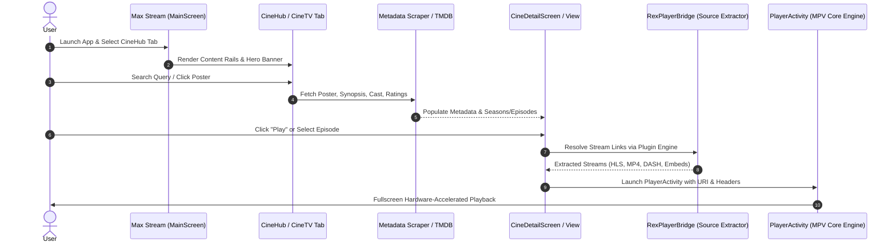
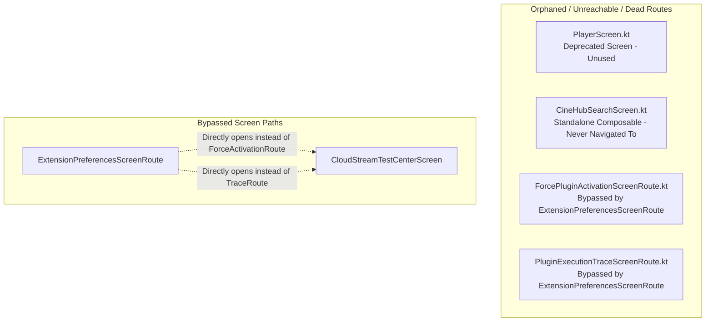

# MAX STREAM / CINEHUB — COMPLETE SCREEN FLOW DIAGRAM & ARCHITECTURE

## 1. High-Level Application Lifecycle & Navigation Graph

```mermaid
flowchart TD
    %% Entry Points
    A1[App Launcher Intent] --> Splash[SplashScreen]
    A2[External File/URL Intent (VIEW/SEND)] --> PlayerAct[PlayerActivity]
    A3[Media Info Intent (SEND/VIEW)] --> MediaInfoAct[MediaInfoActivity]
    A4[Web Share Intent (SEND/SEND_MULTIPLE)] --> WebShareAct[WebShareActivity]
    A5[Application Uncaught Exception] --> CrashAct[CrashActivity]

    %% Splash Decision
    Splash -->|Onboarding Completed = false| Welcome[WelcomeScreen]
    Splash -->|Onboarding Completed = true| Main[MainScreen]
    Welcome -->|Complete / Skip Onboarding| Main

    %% MainScreen Tabs
    subgraph MainScreen_BottomBar [MainScreen Container - Bottom Navigation Tabs]
        direction TB
        Tab0[Tab 0: Files / Home] --> ModeCheck{ViewMode}
        ModeCheck -->|FolderViewMode.FolderList| FolderList[FolderListScreen]
        ModeCheck -->|FolderViewMode.FileManager| FileSysRoot[FileSystemBrowserRootScreen]

        Tab1[Tab 1: Shorts] --> Shorts[ShortsScreen]
        Tab2[Tab 2: CineHub] --> CineHub[CineHubScreen]
        Tab3[Tab 3: CineTV] --> LiveTv[LiveTvTabScreen]
        Tab4[Tab 4: Recents] --> Recents[RecentlyPlayedScreen]
        Tab5[Tab 5: Playlists] --> Playlists[PlaylistScreen]
        Tab6[Tab 6: Network] --> NetworkStream[NetworkStreamingScreen]
    end

    %% Sub-routes from FolderList & FileManager
    FolderList -->|Click Folder Card| VideoList[VideoListScreen]
    FolderList -->|TopBar Search Icon| LocalSearch[SearchScreen]
    FolderList -->|TopBar Settings Icon| Settings[PreferencesScreen]
    VideoList -->|Click Video Card| PlayLocal[PlayerActivity]
    FileSysRoot -->|Click Directory| FileSysDir[FileSystemDirectoryScreen]
    FileSysDir -->|Click Sub-directory| FileSysDir
    FileSysDir -->|Click Video File| PlayLocal

    %% Sub-routes from CineHub
    CineHub -->|Click Media Card / Hero Banner| CineDetail[CineDetailScreen / CineDetailView]
    CineHub -->|Click See All Rail Card| SeeAllSheet[MaxStreamSeeAllSheet]
    CineHub -->|Provider Switcher| ProviderSheet[ProviderSelectorSheet]
    CineHub -->|Select Stream / Episode| RexBridge[RexPlayerBridge Source Resolver]
    RexBridge -->|Resolved Stream URL| PlayerAct

    %% Sub-routes from CineTV
    LiveTv -->|Select Channel / Live Stream| PlayerAct
    LiveTv -->|Click Channel Info / Guide| ChannelGuide[Channel Guide Modal]

    %% Sub-routes from Shorts
    Shorts -->|More Options Sheet| ShortsMore[MoreActionsSheet]
    ShortsMore -->|Blocked Videos Manager| BlockedShorts[BlockedShortsScreen]
    ShortsMore -->|Share| ShareIntent[Android Share Sheet]

    %% Sub-routes from Playlists
    Playlists -->|Click Playlist Card| PlaylistDetail[PlaylistDetailScreen]
    PlaylistDetail -->|Click Playlist Item| PlayerAct

    %% Sub-routes from Network
    NetworkStream -->|Add / Edit Connection| AddConnDialog[AddConnectionDialog]
    NetworkStream -->|Click Connection| NetBrowser[NetworkBrowserScreen]
    NetBrowser -->|Click Remote Video| PlayerAct

    %% Sub-routes from Settings / Preferences
    Settings -->|Search Preferences| SettingsSearch[SettingsSearchScreen]
    Settings -->|Plugin Extensions| ExtPrefs[ExtensionPreferencesScreenRoute]
    Settings -->|UI & Appearance| AppearPrefs[AppearancePreferencesScreen]
    Settings -->|Playback & Controls| PlayPrefs[PlayerPreferencesScreen]
    Settings -->|Control Layout| CtrlLayout[PlayerControlsPreferencesScreen]
    CtrlLayout -->|Edit Region| CtrlEditor[ControlLayoutEditorScreen]
    Settings -->|Gestures| GestPrefs[GesturePreferencesScreen]
    Settings -->|Media Library| MedLibPrefs[MediaLibraryPreferencesScreen]
    MedLibPrefs -->|Folders Filter| FoldersPrefs[FoldersPreferencesScreen]
    MedLibPrefs -->|Library Roots| RootsPrefs[LibraryRootsPreferencesScreen]
    Settings -->|Decoders| DecPrefs[DecoderPreferencesScreen]
    DecPrefs -->|Codec Info| CodecInfo[CodecInformationScreen]
    Settings -->|Subtitles| SubPrefs[SubtitlesPreferencesScreen]
    Settings -->|Audio| AudPrefs[AudioPreferencesScreen]
    Settings -->|RexShorts Settings| ShortsPrefs[ShortsPreferencesScreen]
    ShortsPrefs -->|Blocked List| BlockedShorts
    Settings -->|Jellyfin Sync| JellyfinPrefs[JellyfinSettingsScreen]
    Settings -->|yt-dlp| YtdlPrefs[YtdlSettingsScreen]
    Settings -->|Advanced Settings| AdvPrefs[AdvancedPreferencesScreen]
    AdvPrefs -->|mpv.conf / input.conf| CfgEditor[ConfigEditorScreen]
    AdvPrefs -->|Lua Scripts| LuaScripts[LuaScriptsScreen]
    LuaScripts -->|New / Edit Script| LuaEditor[LuaScriptEditorScreen]
    AdvPrefs -->|Custom Buttons| CustButtons[CustomButtonScreen]
    Settings -->|Developer Options| DevPrefs[DeveloperOptionsScreen]
    DevPrefs -->|CloudStream Test Center| CloudTest[CloudStreamTestCenterScreen]
    DevPrefs -->|Extension Repositories| ExtRepos[ExtensionRepositoriesScreenRoute]
    DevPrefs -->|Installed Extensions| ExtInstalled[InstalledExtensionsScreenRoute]
    DevPrefs -->|Repository Presets| ExtPresets[RepositoryPresetsScreenRoute]
    Settings -->|About & Libraries| About[AboutScreen]
    About -->|Open Source Licenses| LibsScreen[LibrariesScreen]

    %% Extension Preferences Subroutes
    ExtPrefs --> ExtRepos
    ExtPrefs --> ExtInstalled
    ExtPrefs --> ExtPresets
    ExtPrefs --> CloudTest
```

---

## 2. Core Playback & Media Discovery Flow (Target vs Actual)



---

## 3. Discovered Anomalies & Dead/Orphan Routes


